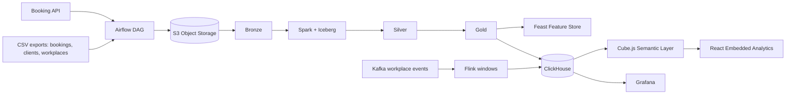

# Архитектура платформы

Платформа разделена по доменам Data Mesh. Домен `booking_operations` отвечает за бронирования и выручку, `space_operations` - за загрузку рабочих мест и зон, `customer_engagement` - за активность и удержание клиентов.

Основной Lakehouse хранится в S3-совместимом Object Storage. Таблицы Bronze/Silver/Gold создаются через Spark и Apache Iceberg, что дает ACID-транзакции, time travel и эволюцию схем.
